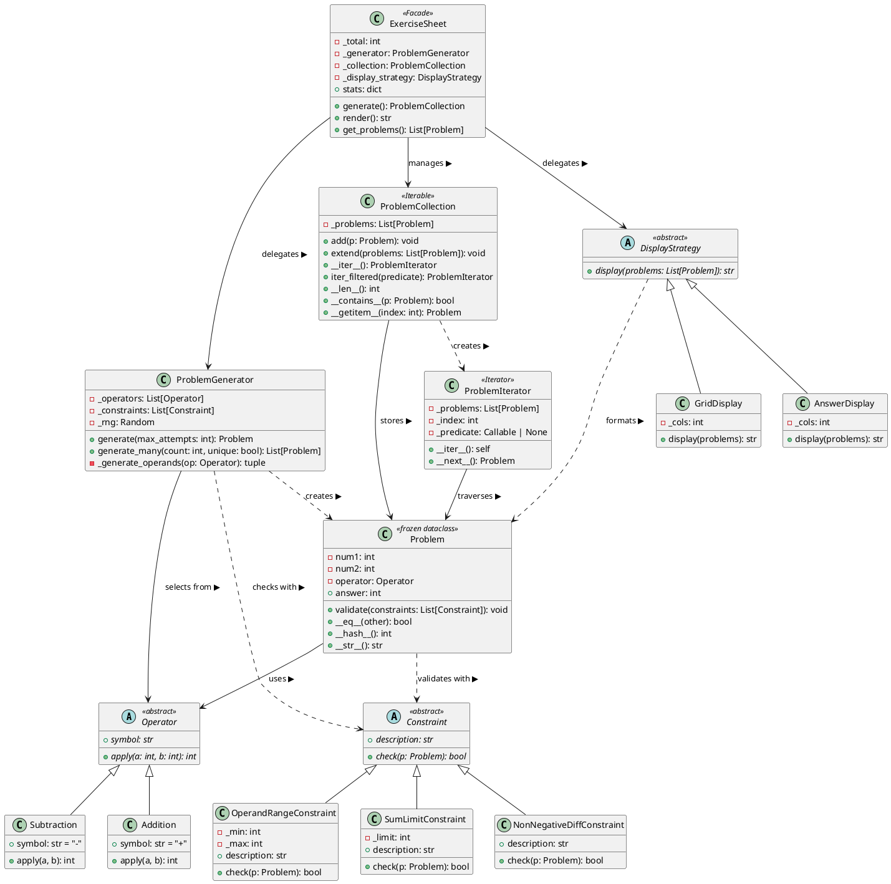

# UML 类图设计

## 1. 完整类图（PlantUML）



## 2. 设计模式应用总结

| 模式 | 参与者 | 角色 |
|------|--------|------|
| **策略模式** | `Operator` / `Addition` / `Subtraction` | 封装可互换的运算算法 |
| **策略模式** | `Constraint` / `SumLimitConstraint` / ... | 封装可组合的校验规则 |
| **策略模式** | `DisplayStrategy` / `GridDisplay` / `AnswerDisplay` | 封装可互换的显示算法 |
| **迭代器模式** | `ProblemCollection` / `ProblemIterator` | 分离集合与遍历逻辑 |
| **外观模式** | `ExerciseSheet` | 为子系统提供统一入口 |

## 3. SOLID 原则落地

| 原则 | 实现位置 | 说明 |
|------|----------|------|
| **SRP** 单一职责 | `operators.py`, `constraints.py`, `display.py` | 每个类只有一种职责（运算/校验/显示） |
| **OCP** 开放-封闭 | 所有 ABC 子类体系 | 新增运算符/约束/显示格式只需添加子类 |
| **DIP** 依赖倒转 | `ProblemGenerator`, `Problem` | 依赖 Operator/Constraint 抽象，不依赖具体类 |
| **LSP** 里氏代换 | `Addition` / `Subtraction` | 子类可透明替换 Operator 基类 |
| **ISP** 接口隔离 | `Operator`, `Constraint`, `DisplayStrategy` | 每个接口只定义最小必要方法集 |

## 4. 核心交互序列

```
Client → ExerciseSheet.render()
           │
           ├─→ ProblemGenerator.generate_many(50)
           │     └─→ generate() × N 次
           │           ├─→ 随机选择 Operator 策略
           │           ├─→ _generate_operands()
           │           ├─→ Problem(…)
           │           └─→ problem.validate(constraints)  ← 策略模式校验
           │
           ├─→ ProblemCollection(problems)                ← 存储
           │
           └─→ DisplayStrategy.display(problems)          ← 策略模式渲染
                 └─→ GridDisplay / AnswerDisplay
```
