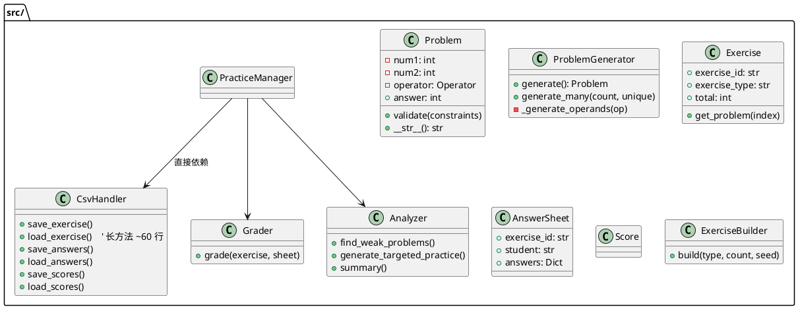

# UML 类图对比 —— 重构前 vs 重构后

## 重构前 UML（dataproc 版）



### 重构前主要问题

| 问题 | 影响 |
|------|------|
| `CsvHandler.load_exercise()` 60+ 行长方法 | 难以测试和修改 |
| `PracticeManager` 直接耦合 `CsvHandler` | 无法替换存储实现 |
| 报告格式化逻辑散落 `main.py` 和 `Analyzer` | 输出格式修改需改多处 |
| `generate_many(count, unique=True)` 语义模糊 | 参数含义不直观 |
| `num1/num2` 命名 | 数学含义不清晰 |
| 配置参数散落各处 | 修改默认值需找多个文件 |
| `print()` 调试 | 无级别控制 |

---

## 重构后 UML

```plantuml
@startuml
' 重构后: 分层子包结构

package "mathpractice/" {
  
  package "core/" <<核心领域>> {
    abstract class Operator {
      + {abstract} symbol
      + {abstract} apply(left, right)
    }
    class Addition
    class Subtraction
    
    abstract class Constraint {
      + {abstract} is_satisfied(problem)
      + {abstract} description
    }
    class OperandRangeConstraint
    class SumLimitConstraint
    class NonNegativeDiffConstraint
    
    class Problem {
      - left: int         ' 重命名 num1 → left
      - right: int        ' 重命名 num2 → right
      + answer: int
      + expression: str   ' 新属性
      + validate_against(constraints)
    }
    
    class ProblemGenerator {
      + generate_one()        ' 重命名
      + generate_unique(count)' 语义拆分
      + generate_batch(count) ' 语义拆分
      - _pick_operands(op)    ' 提取方法
    }
  }
  
  package "models/" <<数据模型>> {
    class Exercise { + problem_count: int ' 重命名 }
    class AnswerSheet
    class Score { - _check_invariants() ' 提取方法 }
    class StudentRecord { + record(score) ' 重命名 }
  }
  
  package "services/" <<业务服务>> {
    class Grader {
      + evaluate(ex, sheet)   ' 重命名
      - _check_preconditions()' 提取方法
    }
    class Analyzer {
      + identify_weak_areas() ' 重命名
      + build_targeted_practice()' 重命名
      + summarize()           ' 重命名
    }
    class Reporter {          ' 新提取的类!
      + format_summary()
      + format_weak_problems()
      + format_problem_grid()
      + format_score_detail()
    }
    class ExerciseBuilder {
      + build(type, count, seed)
      + build_from_config(cfg)
      ' EXERCISE_TYPES 表
    }
  }
  
  package "io/" <<数据访问>> {
    class CsvHandler {
      ' 长方法拆分为小方法
      - _parse_exercise_csv()
      - _parse_problem_row()
    }
    class ExerciseRepository {  ' 新提取的类!
      + save_exercise()
      + find_exercise()
      + cached_exercises()
      + save_scores()
      + load_scores()
    }
  }
  
  class Config {              ' 新引入的类!
    + exercise_count
    + seed
    + data_dir
    + display_cols
    + log_level
  }
  
  class Application {         ' 重命名
    - cfg: Config
    - _repo: ExerciseRepository
    - _grader: Grader
    - _analyzer: Analyzer
    - _reporter: Reporter
  }
}

Operator <|-- Addition
Operator <|-- Subtraction
Constraint <|-- OperandRangeConstraint
Constraint <|-- SumLimitConstraint
Constraint <|-- NonNegativeDiffConstraint
Problem --> Operator
ProblemGenerator --> Operator
ProblemGenerator ..> Constraint
Exercise --> Problem
Application --> Config : 依赖注入
Application --> ExerciseRepository : 依赖注入
Application --> Grader
Application --> Analyzer
Application --> Reporter
ExerciseRepository --> CsvHandler
Analyzer --> ProblemGenerator
@enduml
```

### 重构后改进

| 改进 | 效果 |
|------|------|
| 子包分层 `core/models/services/io` | 职责清晰，易于导航 |
| `Reporter` 提取 | 输出格式集中管理，SRP |
| `Repository` 提取 | 数据访问解耦，可替换存储 |
| `Config` 引入 | 参数集中管理，一处修改 |
| 方法重命名 12+ 处 | 语义清晰 (`generate_one` vs `generate`) |
| 长方法拆分 5+ 处 | 每个方法 < 30 行，易测试 |
| `logging` 替代 `print` | 级别控制，生产可用 |
| `left/right` 替代 `num1/num2` | 数学语义更准确 |
