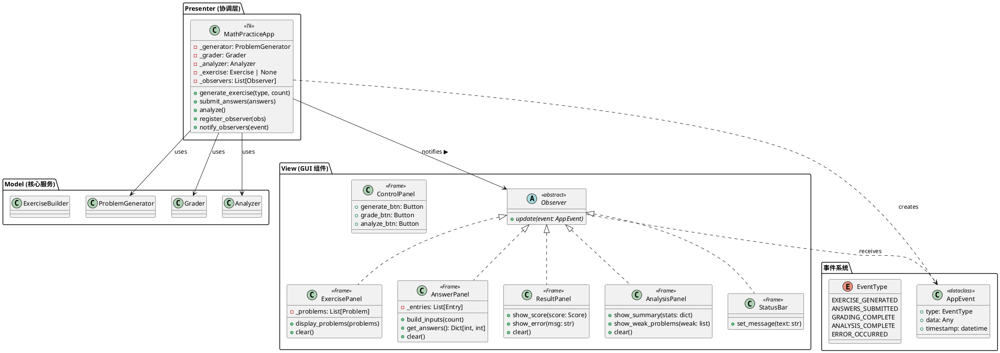

# GUI 类图设计

## MVP 架构 + 观察者模式



## 事件驱动编程 —— 事件清单

| 事件 | 触发源 | 监听者 | 行为 |
|------|--------|--------|------|
| `<<GenerateExercise>>` | Button click | App._on_generate | 生成习题 |
| `EXERCISE_GENERATED` (虚拟) | App | ExercisePanel, AnswerPanel, StatusBar | 显示题目/输入框/状态 |
| `<<GradeAnswers>>` | Button click | App._on_grade | 读取答案→判题 |
| `GRADING_COMPLETE` (虚拟) | App | ResultPanel, StatusBar | 显示成绩 |
| `<<Analyze>>` | Button click | App._on_analyze | 分析成绩 |
| `ANALYSIS_COMPLETE` (虚拟) | App | AnalysisPanel | 显示弱项 |
| `<Key-Return>` | Entry | App._on_submit | 提交答案 |
| `<FocusIn>` | Entry | AnswerPanel | 高亮输入框 |
| `ERROR_OCCURRED` (虚拟) | App | StatusBar, ResultPanel | 显示错误 |

### 交互序列

```
用户点击"生成" 
  → Button <Button-1> 事件
    → App._on_generate()
      → ProblemGenerator.generate_unique(50)
      → 创建 Exercise 对象
      → notify_observers(EXERCISE_GENERATED, exercise)
        → ExercisePanel.update() 显示题目
        → AnswerPanel.update() 创建输入框
        → StatusBar.update() 更新状态

用户填入答案后点"提交"
  → Button <Button-1> 事件
    → App._on_grade()
      → AnswerPanel.get_answers()
      → Grader.evaluate(exercise, answer_sheet)
      → notify_observers(GRADING_COMPLETE, score)
        → ResultPanel.update() 显示成绩
        → StatusBar.update() 显示完成
```
