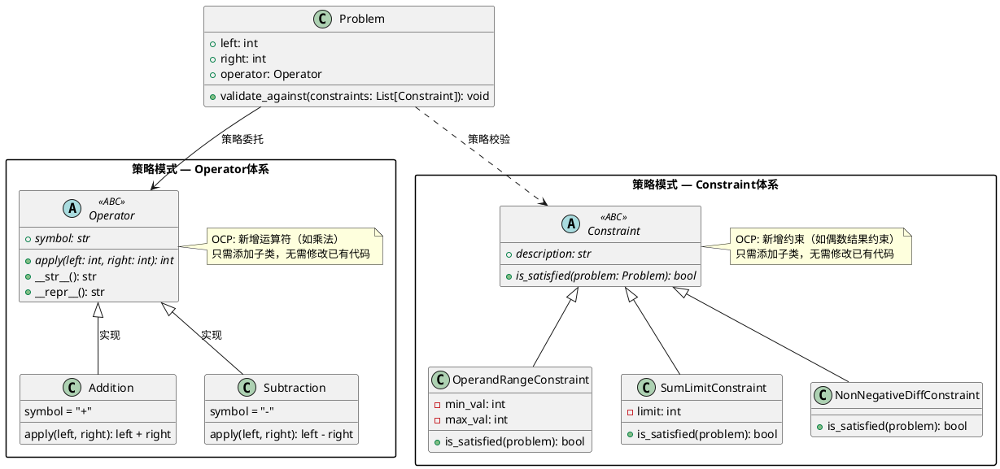
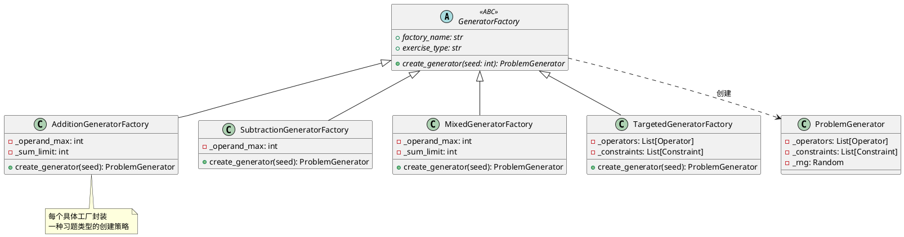
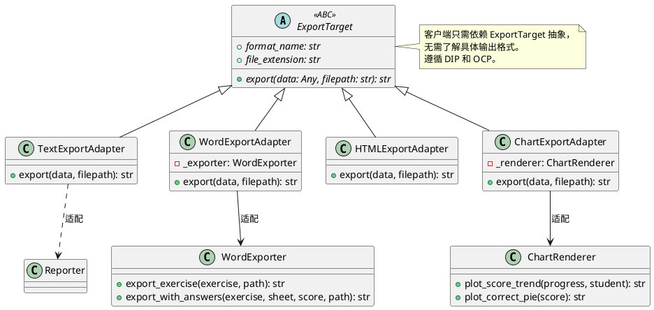
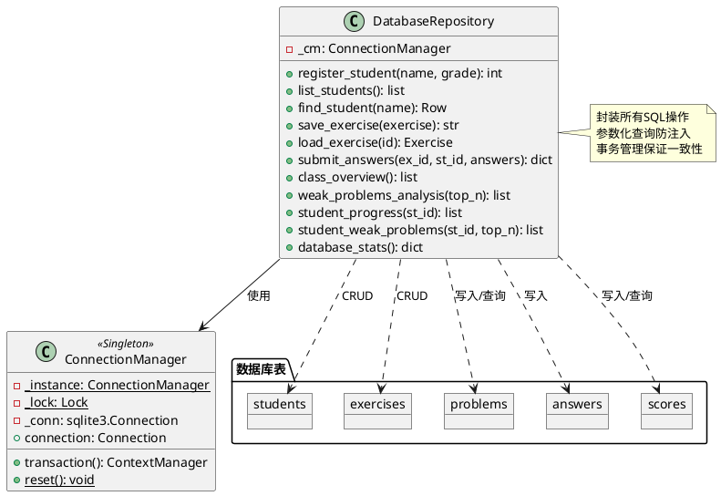
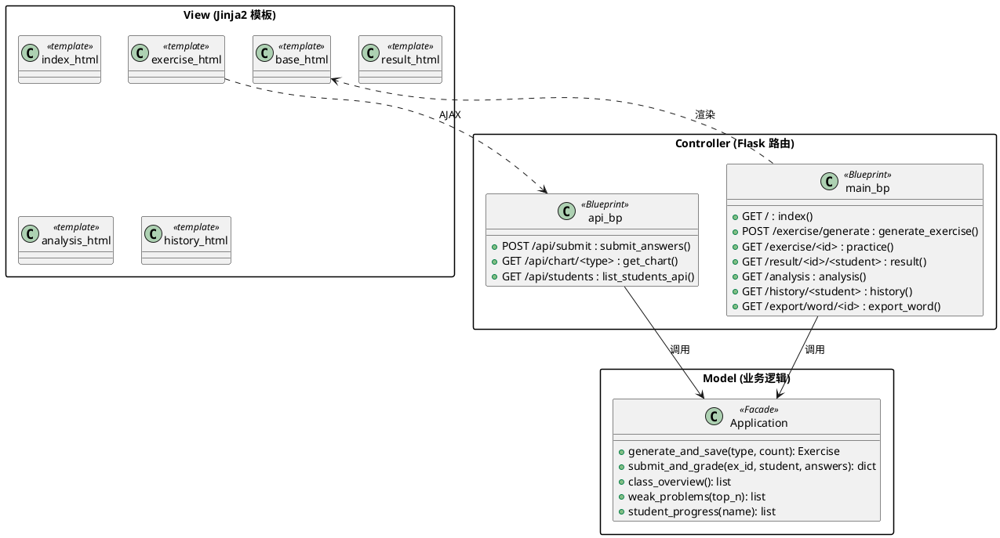
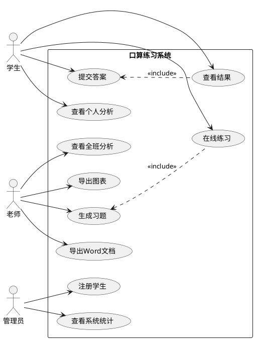
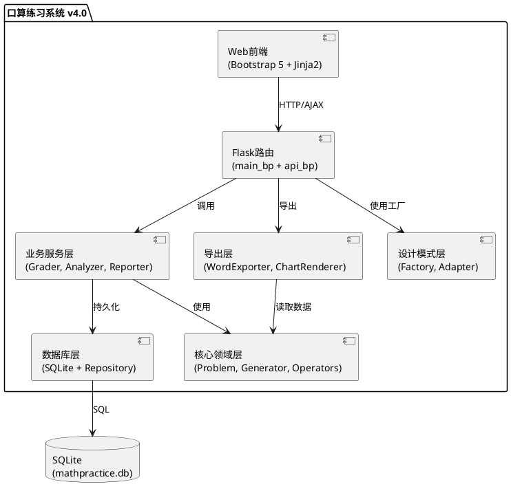

# 口算练习系统 —— UML类图

## 1. 完整系统类图

```plantuml
@startuml 完整系统类图
' ============================================================
' 口算练习系统 v4.0 —— 完整类图
' ============================================================

' ---- 核心领域层 ----
package "core (核心领域层)" {
  abstract class Operator <<ABC>> {
    + {abstract} symbol: str
    + {abstract} apply(left: int, right: int): int
  }

  class Addition {
    + symbol: str = "+"
    + apply(left, right): int
  }

  class Subtraction {
    + symbol: str = "-"
    + apply(left, right): int
  }

  abstract class Constraint <<ABC>> {
    + {abstract} is_satisfied(problem: Problem): bool
    + {abstract} description: str
  }

  class OperandRangeConstraint {
    - min_val: int
    - max_val: int
    + is_satisfied(problem): bool
  }

  class SumLimitConstraint {
    - limit: int
    + is_satisfied(problem): bool
  }

  class NonNegativeDiffConstraint {
    + is_satisfied(problem): bool
  }

  class Problem <<frozen dataclass>> {
    + left: int
    + right: int
    + operator: Operator
    + answer: int
    + expression: str
    + validate_against(constraints): void
  }

  class ProblemGenerator {
    - _operators: List[Operator]
    - _constraints: List[Constraint]
    - _rng: Random
    + generate_one(): Problem
    + generate_unique(count): List[Problem]
    + generate_batch(count): List[Problem]
    - _pick_operands(operator): tuple
  }

  Operator <|-- Addition
  Operator <|-- Subtraction
  Constraint <|-- OperandRangeConstraint
  Constraint <|-- SumLimitConstraint
  Constraint <|-- NonNegativeDiffConstraint
  Problem --> Operator
  Problem ..> Constraint
  ProblemGenerator --> Operator
  ProblemGenerator --> Constraint
  ProblemGenerator ..> Problem
}

' ---- 数据模型层 ----
package "models (数据模型层)" {
  class Exercise <<frozen dataclass>> {
    + exercise_id: str
    + exercise_type: str
    + problems: List[Problem]
    + created_at: datetime
    + problem_count: int
    + get_problem(index: int): Problem
  }

  class AnswerSheet <<frozen dataclass>> {
    + exercise_id: str
    + student: str
    + answers: Dict[int, int]
    + submitted_at: datetime
    + get_answer(index: int): int
  }

  class Score <<frozen dataclass>> {
    + exercise_id: str
    + student: str
    + total: int
    + correct: int
    + wrong: int
    + percentage: float
    + wrong_indices: List[int]
    + graded_at: datetime
    - _check_invariants(): void
  }

  class StudentRecord <<dataclass>> {
    + name: str
    + scores: List[Score]
    + record(score): void
    + session_count: int
    + average_score: float
  }

  Exercise --> Problem
  Score ..> Exercise
}

' ---- 业务服务层 ----
package "services (业务服务层)" {
  class Grader {
    + evaluate(exercise, answer_sheet): Score
    - _check_preconditions(): void
  }

  class Analyzer {
    - _scores: List[Score]
    + identify_weak_areas(exercise_map): List[dict]
    + build_targeted_practice(exercise_map, count): List[Problem]
    + summarize(): dict
    + add_scores(scores): void
  }

  class Reporter {
    + {static} format_summary(summary): str
    + {static} format_weak_problems(weak): str
    + {static} format_problem_grid(problems, cols): str
    + {static} format_score_detail(score): str
  }

  class ExerciseBuilder {
    - {static} EXERCISE_TYPES: dict
    - {static} _counter: int
    + {static} build(type, count, seed): Exercise
    + {static} list_types(): list
  }

  class ChartService {
    - _output_dir: Path
    + plot_score_trend(progress, student): str
    + plot_correct_pie(score): str
    + plot_weak_bar(weak_problems): str
    + plot_multi_session_bars(records): str
    + plot_student_comparison(overview): str
  }

  Grader ..> Score
  Analyzer ..> Score
  Analyzer ..> Problem
  ExerciseBuilder ..> Exercise
  ExerciseBuilder ..> ProblemGenerator
}

' ---- 数据库层 ----
package "db (数据库层)" {
  class ConnectionManager <<Singleton>> {
    - {static} _instance: ConnectionManager
    - {static} _lock: Lock
    - _conn: Connection
    + connection: Connection
    + transaction(): ContextManager
    + {static} reset(): void
    + close(): void
  }

  class DatabaseRepository {
    - _cm: ConnectionManager
    + register_student(name, grade): int
    + save_exercise(exercise): str
    + load_exercise(id): Exercise
    + submit_answers(ex_id, st_id, answers): dict
    + class_overview(): list
    + weak_problems_analysis(top_n): list
    + student_progress(st_id): list
    + database_stats(): dict
  }

  DatabaseRepository --> ConnectionManager
  DatabaseRepository ..> Exercise
}

' ---- 设计模式层 ----
package "patterns (设计模式层)" {
  abstract class GeneratorFactory <<ABC>> {
    + {abstract} create_generator(seed): ProblemGenerator
    + {abstract} factory_name: str
    + {abstract} exercise_type: str
  }

  class AdditionGeneratorFactory {
    + create_generator(seed): ProblemGenerator
  }

  class SubtractionGeneratorFactory {
    + create_generator(seed): ProblemGenerator
  }

  class MixedGeneratorFactory {
    + create_generator(seed): ProblemGenerator
  }

  class TargetedGeneratorFactory {
    + create_generator(seed): ProblemGenerator
  }

  abstract class ExportTarget <<ABC>> {
    + {abstract} export(data, filepath): str
    + {abstract} format_name: str
    + {abstract} file_extension: str
  }

  class TextExportAdapter {
    + export(data, filepath): str
  }

  class WordExportAdapter {
    - _exporter: WordExporter
    + export(data, filepath): str
  }

  class HTMLExportAdapter {
    + export(data, filepath): str
  }

  class ChartExportAdapter {
    - _renderer: ChartRenderer
    + export(data, filepath): str
  }

  GeneratorFactory <|-- AdditionGeneratorFactory
  GeneratorFactory <|-- SubtractionGeneratorFactory
  GeneratorFactory <|-- MixedGeneratorFactory
  GeneratorFactory <|-- TargetedGeneratorFactory
  ExportTarget <|-- TextExportAdapter
  ExportTarget <|-- WordExportAdapter
  ExportTarget <|-- HTMLExportAdapter
  ExportTarget <|-- ChartExportAdapter
}

' ---- 导出/图表层 ----
package "export & chart (导出和图表)" {
  class WordExporter {
    - _font_name: str
    - _columns: int
    + export_exercise(exercise, path): str
    + export_with_answers(exercise, sheet, score, path): str
    + export_multi_exercise(exercises, path): str
  }

  class ChartRenderer {
    - _output_dir: Path
    + plot_score_trend(progress, student): str
    + plot_correct_pie(score): str
    + plot_weak_bar(weak_problems): str
    + plot_multi_session_bars(records): str
    + plot_student_comparison(overview): str
  }

  WordExportAdapter --> WordExporter
  ChartExportAdapter --> ChartRenderer
}

' ---- 应用层 ----
package "application (应用层)" {
  class Application <<Facade>> {
    - _operators: List[Operator]
    - _constraints: List[Constraint]
    - _generator: ProblemGenerator
    - _repo: DatabaseRepository
    + register_student(name, grade): int
    + generate_and_save(type, count): Exercise
    + submit_and_grade(ex_id, student, answers): dict
    + class_overview(): list
    + weak_problems(top_n): list
    + student_progress(name): list
  }

  Application --> ProblemGenerator
  Application --> DatabaseRepository
}

' ---- Web层 ----
package "web (Web应用层)" {
  class FlaskApp <<Flask>> {
    + config: dict
    + register_blueprint(bp): void
  }

  class main_bp <<Blueprint>> {
    + GET /
    + POST /exercise/generate
    + GET /exercise/<id>
    + GET /result/<id>/<student>
    + GET /analysis
    + GET /history/<student>
    + GET /export/word/<id>
  }

  class api_bp <<Blueprint>> {
    + POST /api/submit
    + GET /api/chart/<type>
    + GET /api/students
  }

  FlaskApp --> main_bp
  FlaskApp --> api_bp
  main_bp ..> Application
  api_bp ..> Application
}

@enduml
```

## 2. 策略模式类图（Operator + Constraint）

## 3. 工厂方法模式类图

## 4. 适配器模式类图

## 5. 数据库仓库模式类图

## 6. Web应用MVC类图

## 7. 用例图

## 8. 组件图

## 设计模式应用汇总

| 模式 | 应用位置 | 目的 |
|------|---------|------|
| **策略模式** | `Operator` 体系, `Constraint` 体系 | 多态替换运算规则和校验规则 |
| **工厂方法** | `GeneratorFactory` 体系 | 封装不同类型习题生成器的创建 |
| **适配器** | `ExportTarget` 体系 | 统一文本/Word/HTML/图表导出接口 |
| **外观** | `Application` 类 | 为CLI和Web提供统一的业务API |
| **仓库** | `DatabaseRepository` | 封装数据访问，隔离SQL细节 |
| **单例** | `ConnectionManager` | 全局共享数据库连接 |
| **表驱动** | `EXERCISE_TYPES`, `FACTORY_REGISTRY`, `ADAPTER_REGISTRY` | 用数据配置替代条件分支 |
| **设计契约** | `Score._check_invariants()`, `Grader._check_preconditions()` | 运行时契约检查 |
| **上下文管理器** | `ConnectionManager.transaction()` | 自动commit/rollback |
